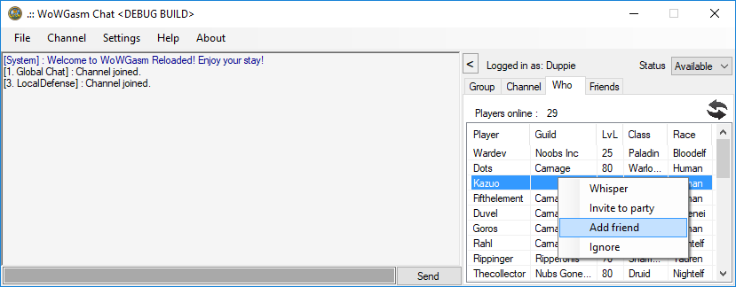
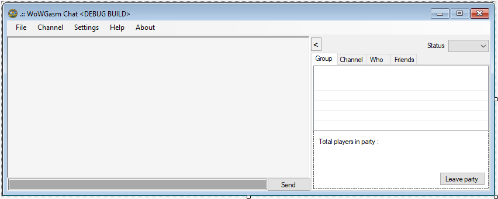

# WoWGasm chat client & debug poc

**Working features**
- Login (show wrong creds/usr, give msgbox when logon server is not reachable), logout, realm selection, character selection
- Server motd, guild roster
- Chat channels (custom, glabal, trade, ..)
- System messages (local and remote)
- Full who list /w full listview
- Group / party listview full + player join/leave notifications
- Friend list /w Add & Remove friend listview (Player, Guild, LvL, online/offline & system notification on friend online/offline state change)
- Character status
- Simple afk system and status changer
- Chat window color picker
- System channel colors added
- Achievements show the right items instead of %
- A lot of settings
- Chat channels like Whisper, Guild, Party, General, Officer..
- Party/Group chat invitation and listview of players / disband group
- Join custom channel, create custom channel /w pw, leave channels

**Not working**
- Player Ignore (don't remember why, see code. Maybe better to store a local ignore list or simply by session)
- FrmSettings.cs not implemented yet. Idea for AFK status changer was to let a interrupt check the users mouse pointer XYZ pos if this did not change since the last time, exec changeAFKstatus.
- Leave channel 3 and 4. See the packet handler why..

**Buggy, needs improvement**
- Custom channel listview and channel number for example .5 and .6
- Party/Group notifications are incorrect sometime. If player disconnects too fast without properly disposing the session on the server (not sure what wc cmd orig client sends) upon rejoin group SMSG_PARTY_COMMAND_RESULT will be buggy.

**Graphhical user interface**
- Screendump;

**Todo**
- Refactor code, clean code, improve improve improve..

- Stop using: System.Text.Encoding.UTF8.GetString
In chat packethandlers, use readbyte or readbytes and loop through each byte using the specified algorithm for that handler..

---------------------------------------------------------------------
Change log;
17-2-2018
Added:
- channels listview
- custom channels listview
- options added to channel menu strip (leave, leave all, etc) 

TODO:
-settings menu is not made yet, need to code all the stuff
-save custom channels locally
-remove friend not working, sending reversed guid in hex with trailing 6 nullbytes, nothing happens..
-channels listview and custom channals locally saved
-ignore locally
-clean code, refactor, compile CLI/Client on Win 7 SDK
-alot more....
 
---------------------------------------------------------------------
15-2-2018
Added:
- Friend list
- Minor gui changes
- Context menu's

TODO:
-remove friend not working, sending reversed guid in hex with trailing 6 nullbytes, nothing happens..
-channels listview and custom channals locally saved
-ignore locally 

---------------------------------------------------------------------
13-2-2018
Added:
- ListView context menu
- Friend status combobox (Available Away Busy)

TODO:
Fix friend list > handler response bytecode GUID extractor
Fix ignore locally

---------------------------------------------------------------------
11-2-2018
Added:
- Who listview

Fixes:
- A few minor code changes..

---------------------------------------------------------------------
8-2-2018
Added:
-Party group functionality, nice listview /w leader, join, leave message and disband handling
-Tab Group
- /invite <player>

Changes:
-small fixes for testers.

---------------------------------------------------------------------
7-2-2018
Added:
-Join custom channel(create custom channel fill in the channel you want to join) this will be changed but for now it's fine
-Custom channel
-Channel notify packet handler improved (no sender guid implemented yet)
-Channel invitation messagebox yes/no (no sender guid implemented yet)
-Who list now properly enums race/gender/class..

Changes:
-Join all channels is under channal tab, this option allows you to join ALL default channels.

Removed:
-Yawns sleepily each 5 minutes
-Debug timer/code that wasted extra cpu cycles
